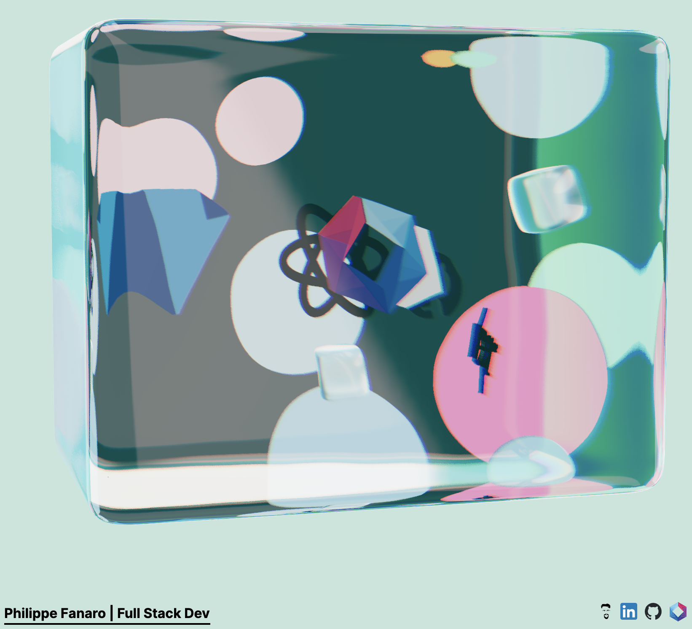

# Philippe Fanaro's Three.js Portfolio

My portfolio, done with [Three.js](https://threejs.org/). It's more like an entry point to my stuff actually.

## What am I using?

- [NextJS](https://nextjs.org/)
- [React](https://react.dev/)
- [Three.js](https://threejs.org/) through:
  - [React Three Fiber](https://docs.pmnd.rs/react-three-fiber/getting-started/introduction)
  - [Drei](https://github.com/pmndrs/drei)
  - [React Three Rapier](https://github.com/pmndrs/react-three-rapier), a physics engine for Three.js
- [Tailwind](https://tailwindcss.com/)
- [shadcn/ui](https://ui.shadcn.com/)
- [daisyUI](https://daisyui.com/)

## References

- A lot of my learning is done through my [three-lab repository](https://github.com/psygo/three-lab).
- [Three.js Examples](https://threejs.org/examples/#webgl_animation_keyframes)
- My fundamentals come from Bruno Simon's amazing [Three.js Journey](https://threejs-journey.com/) course.
- From [React Three Fiber's Showcase Examples](https://docs.pmnd.rs/react-three-fiber/getting-started/examples):
  - [Color Grading](https://codesandbox.io/p/sandbox/color-grading-wvgxp?file=%2Fsrc%2FApp.js)
  - [React Ellipse Curve](https://codesandbox.io/p/sandbox/react-ellipsecurve-xzi6ps?file=%2Fsrc%2FApp.js)
  - [Portals](https://codesandbox.io/p/sandbox/portals-ik11ln?file=%2Fsrc%2FApp.js)
  - [Aquarium](https://codesandbox.io/p/sandbox/aquarium-n7jf0f?file=%2Fsrc%2Findex.js%3A33%2C31)
  - [React EllipseCurve](https://codesandbox.io/p/sandbox/react-ellipsecurve-forked-vwdmx8?file=%2Fsrc%2FApp.js%3A39%2C20)
- [Wawa Sensei's YouTube Channel](https://www.youtube.com/@WawaSensei)
- [Poimandres Open Source Collective](https://github.com/pmndrs)
- 3D HTML:
  - [HTML on a Laptop](https://codesandbox.io/p/sandbox/mixing-html-and-webgl-w-occlusion-9keg6?file=%2Fsrc%2FApp.js%3A32%2C20)
- Others:
  - [Floating Astronaut](https://codesandbox.io/p/sandbox/backdrop-and-cables-2ij9u?file=%2Fsrc%2FApp.js)
